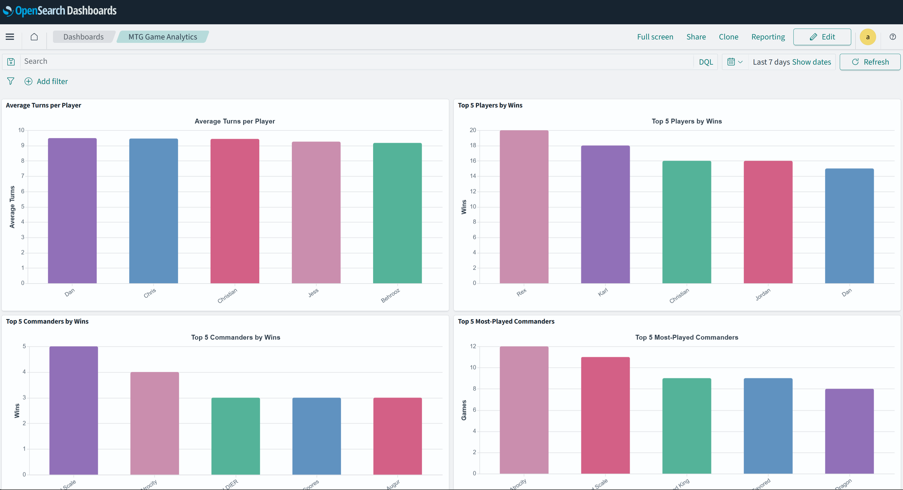
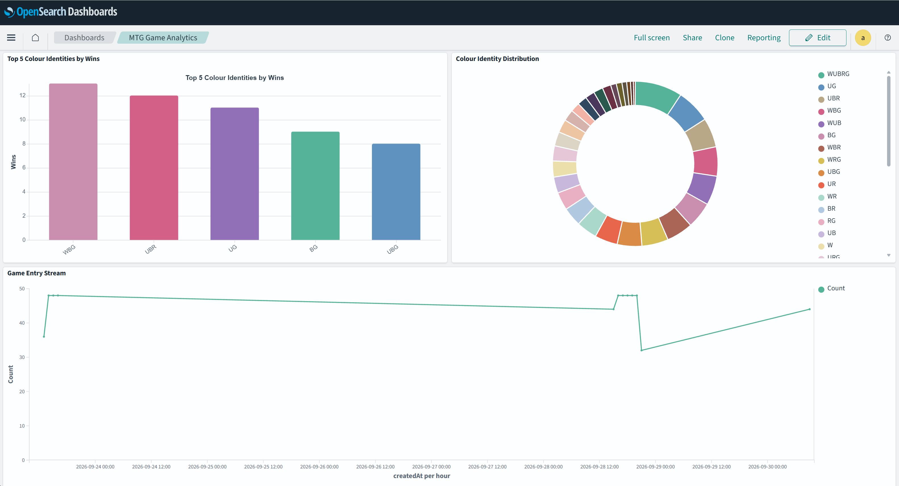
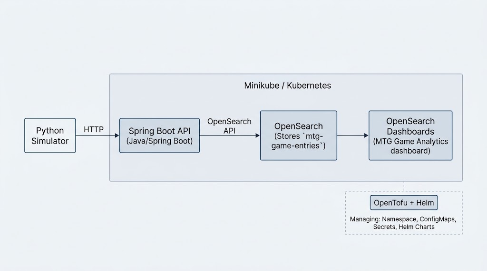

# MTG Analytics Lab

A cloud-native analytics platform for Magic: The Gathering Commander game data. The application generates simulated game results, ingests them through a Spring Boot API, stores them in OpenSearch, and provides analytics through OpenSearch Dashboards.

Magic: The Gathering is used as a fun example, but the underlying architecture could be applied to many types of event and analytics data.

This project was built as a portfolio project to demonstrate practical experience with **Java, Python, Docker, Kubernetes, Helm, OpenTofu, and OpenSearch**.

The project can run locally using Docker Compose or be deployed to a local Kubernetes cluster using Minikube.



---

## Architecture



### Kubernetes architecture

```text
                    Kubernetes
                  mtg-analytics
                        │
        ┌───────────────┼────────────────┐
        │               │                │
        ▼               ▼                ▼
   game-api        opensearch      opensearch-
   Service           Service        dashboards
        │               │                │
        ▼               ▼                ▼
   Spring Boot      OpenSearch       Dashboards
      Pod              Pod               Pod
        │               ▲
        │               │
        └───────────────┘
                │
                ▼
          Python Simulator
```

---

## Features

### Game simulation

The Python simulator generates Commander games containing:

* Players
* Commanders
* Colour identities
* Win/loss results
* Number of turns played
* Game creation timestamps

The simulator generates four-player Commander games with exactly one winner.
Commander selection uses weighted data based on commander popularity.
The simulator continuously submits games to the API at a configurable interval.

---

## REST API

The Spring Boot API provides endpoints for interacting with game data.
These endpoints are outlined below.

### Health/root endpoint

```text
GET /
```

### Retrieve a game entry

```text
GET /game_entry/{id}
```

### Retrieve recent game entries

```text
GET /game_entry_most_recent
```

### Create a game entry

```text
POST /game_entry
```

The API also contains analytics functionality for aggregating game data.

---

## Data model

Each game participation is stored as a game entry.

The primary fields are:

| Field                 | Type         | Description                 |
| --------------------- | ------------ | --------------------------- |
| `player`              | text/keyword | Player name                 |
| `commander`           | text/keyword | Commander used              |
| `colorIdentity`       | keyword      | Commander's colour identity |
| `win`                 | boolean      | Whether the player won      |
| `numberOfTurnsPlayed` | long         | Number of turns in the game |
| `createdAt`           | date         | Time the entry was created  |

The OpenSearch index is:

```text
mtg-game-entries
```
---

## OpenSearch Dashboards

The dashboard is automatically populated with saved objects when the Helm chart is installed or upgraded.

The dashboard currently contains useful game analytics. This is typical of game data and could be similar to something like a sport game data stream.

### Average Turns per Player

### Top 5 Players by Wins

### Top 5 Commanders by Wins

### Top 5 Colour Identities by Wins

### Top 5 Most-Played Commanders

### Colour Identity Distribution

(Shows the distribution of colour identities across the stored game entries.)

### Game Entry Stream

The dashboard is stored as an NDJSON export in the repository:

```text
iac/
└── helm/
    └── opensearch-dashboards/
        └── dashboard_templates/
            └── dashboards.ndjson
```

This means dashboard configuration is treated as code rather than something that has to be manually recreated through the OpenSearch Dashboards UI.

---

## Technology Stack

### Application

* Java
* Spring Boot
* Maven
* Python

### Containers

* Docker
* Docker Compose

### Kubernetes

* Kubernetes
* Minikube
* Helm

### Infrastructure as Code

* OpenTofu

### Data and analytics

* OpenSearch
* OpenSearch Dashboards

---
## Local Development

The recommended way to run the project locally is with **Minikube, OpenTofu and Helm**. Docker Compose is also available as a simpler fallback.

### Prerequisites

For the Kubernetes deployment:

* Docker Desktop
* Minikube
* kubectl
* Helm
* OpenTofu

For the Docker Compose deployment:

* Docker Desktop

### Kubernetes deployment

Start Minikube:

```powershell
minikube start --driver=docker
```

Apply the local infrastructure with OpenTofu:

```powershell
cd .\iac\environments\local
tofu init
tofu apply
cd ..\..\..
```

Install the Helm charts:

```powershell
helm upgrade --install opensearch .\iac\helm\opensearch -n mtg-analytics --wait

helm upgrade --install opensearch-dashboards .\iac\helm\opensearch-dashboards -n mtg-analytics --wait

helm upgrade --install game-api .\iac\helm\game-api -n mtg-analytics --wait
```

Check the deployment:

```powershell
kubectl get pods -n mtg-analytics
```

Access OpenSearch Dashboards:

```powershell
kubectl port-forward svc/opensearch-dashboards 5601:5601 -n mtg-analytics
```

Then open:

```text
http://localhost:5601
```

The dashboard is automatically populated with its saved objects during the Helm deployment, and the Python simulator continuously generates game data.

### Docker Compose

Docker Compose provides a simpler alternative for running the application without Kubernetes.

Start the environment:

```powershell
docker compose up -d --build
```

Check the services:

```powershell
docker compose ps
```

OpenSearch Dashboards is available at:

```text
http://localhost:5601
```

OpenSearch is available at:

```text
http://localhost:9200
```

Stop the environment:

```powershell
docker compose down
```
